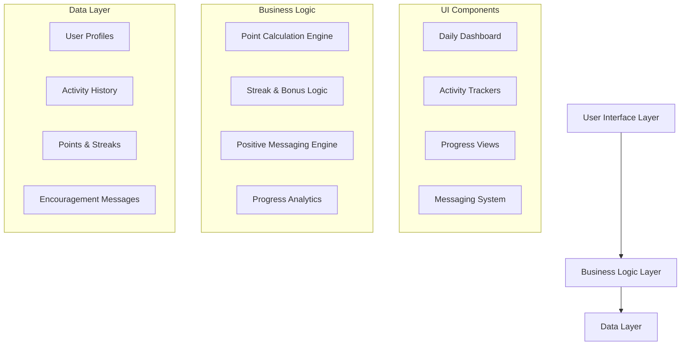
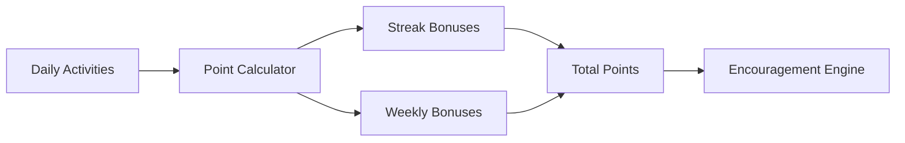

# Design Document

## Overview

The Health Routine Gamification App is a mobile-first wellness tracking application that transforms daily health habits into engaging, point-based activities. The system emphasizes positive reinforcement, consistency over perfection, and treats all health activities as "health investment bills" that users pay to themselves. The app focuses on six core areas: morning light exposure, nutrition tracking, breathing exercises, movement, sleep logging, and body awareness.

## Architecture

### High-Level Architecture



### Technology Stack

- **Frontend**: React Native (cross-platform mobile)
- **Backend**: Node.js with Express
- **Database**: SQLite for local storage with optional cloud sync
- **State Management**: Redux Toolkit for complex state
- **Notifications**: Local push notifications for reminders
- **Analytics**: Local analytics with privacy-first approach

## Components and Interfaces

### Core Components

#### 1. Daily Dashboard
- **Purpose**: Central hub showing today's activities and progress
- **Features**:
  - Quick-access buttons for each health investment bill
  - Real-time point display with encouraging animations
  - Streak indicators with visual progress bars
  - Motivational messaging based on current progress

#### 2. Activity Trackers

##### Morning Light Tracker
- Simple one-tap logging with streak visualization
- Educational tooltips about circadian rhythm benefits
- Weather-independent encouragement (cloudy days still count)
- Flexible timing (any time of day logging)

##### Nutrition Tracker
- MyPlate.gov-based portion input with visual guides
- Per-serving point calculation with running daily totals
- Weekly bonus tracking (3 full days = double points)
- Awareness logging for less optimal choices with positive framing

##### Breathing & Outdoor Time Tracker
- Separate tracking for 5 breaths vs 5 minutes outdoors
- Combination bonus calculation (4x points when both completed)
- Guided breathing instructions with exhale timing
- Outdoor time can be logged independently

##### Movement Tracker
- Flexible exercise input (10-minute increments = 1 point)
- Body awareness check-in with readiness assessment
- Step count manual input
- Exercise suggestions based on reported readiness

##### Sleep Logger
- Duration and quality input with encouraging feedback
- Historical pattern visualization
- Connection to other daily activities when relevant

#### 3. Point System Engine



**Point Calculation Rules**:
- Morning light: 1 point + 3 bonus for 7-day streak
- Nutrition: 1 point per serving + weekly doubling for 3 full days
- Breathing: 1 point for 5 breaths, 1 for 5 min outdoors, 4 for both
- Movement: 1 point per 10 minutes + 1 for body awareness check
- Sleep logging: Points for completion regardless of quality
- Awareness activities: Partial points with educational messaging

#### 4. Encouragement System
- Context-aware positive messaging
- Educational content delivery
- Failure reframing (awareness points, understanding explanations)
- Celebration of consistency over perfection
- Personalized daily summaries

## Data Models

### User Profile
```typescript
interface UserProfile {
  id: string;
  createdAt: Date;
  preferences: {
    reminderTimes: TimePreferences;
    encouragementStyle: 'gentle' | 'enthusiastic' | 'educational';
  };
  streaks: {
    morningLight: number;
    currentStreaks: Record<ActivityType, number>;
    longestStreaks: Record<ActivityType, number>;
  };
}
```

### Daily Activity Log
```typescript
interface DailyLog {
  date: string; // YYYY-MM-DD
  userId: string;
  activities: {
    morningLight: boolean;
    nutrition: {
      fruits: number;
      vegetables: number;
      wholeGrains: number;
      dairy: number;
      nuts: number;
      awarenessItems: string[];
    };
    breathing: {
      fiveBreaths: number; // count of sessions
      outdoorTime: number; // minutes
    };
    movement: {
      exercises: Array<{type: string, duration: number}>;
      bodyAwarenessCheck: boolean;
      stepCount?: number;
      readinessLevel: 'more' | 'same' | 'less';
    };
    sleep: {
      duration?: number;
      quality?: 1 | 2 | 3 | 4 | 5;
    };
  };
  points: {
    daily: number;
    bonuses: number;
    total: number;
  };
  encouragementDelivered: string[];
}
```

### Encouragement Messages
```typescript
interface EncouragementMessage {
  id: string;
  category: ActivityType | 'general' | 'streak' | 'awareness';
  trigger: 'completion' | 'partial' | 'missed' | 'streak';
  message: string;
  educationalContent?: string;
  priority: 'high' | 'medium' | 'low';
}
```

## Error Handling

### Graceful Degradation
- **Offline Mode**: Full functionality with local storage, sync when online
- **Partial Data**: Accept incomplete entries with encouraging messaging
- **Missed Days**: Positive reframing, streak restart encouragement
- **Invalid Input**: Gentle correction with educational context

### User Experience Errors
- **Perfectionism**: Built-in messaging that "something is better than nothing"
- **Comparison**: Focus on personal progress, not absolute standards
- **Guilt**: Reframe missed activities as learning opportunities
- **Overwhelm**: Suggest starting with one activity, building gradually

## Testing Strategy

### Core Functionality Testing
- Point calculation accuracy across all scenarios
- Streak bonus logic validation
- Weekly nutrition bonus calculations
- Data persistence and sync reliability

### User Experience Testing
- Encouragement message appropriateness
- Accessibility compliance (screen readers, color contrast)
- Performance on various device sizes
- Offline functionality validation

### Edge Case Testing
- Leap year date handling
- Time zone changes
- Data migration scenarios
- Recovery from corrupted local data

## Privacy and Security

### Data Privacy
- Local-first architecture with optional cloud backup
- No sharing of personal health data
- User controls all data export/deletion
- Minimal data collection (only what's needed for functionality)

### Security Measures
- Local encryption for sensitive data
- Secure cloud sync protocols if enabled
- No third-party analytics tracking
- User authentication for cloud features only

## Performance Considerations

### Optimization Strategies
- Lazy loading of historical data
- Efficient local database queries
- Minimal battery usage for background tasks
- Smooth animations without performance impact

### Scalability
- Efficient data structures for long-term usage
- Automatic data archiving for old entries
- Optimized sync protocols for large datasets
- Memory management for extended app usage

## Accessibility Features

- Screen reader compatibility for all interactive elements
- High contrast mode support
- Large text options
- Voice input for activity logging
- Simple navigation patterns
- Clear visual hierarchy and feedback